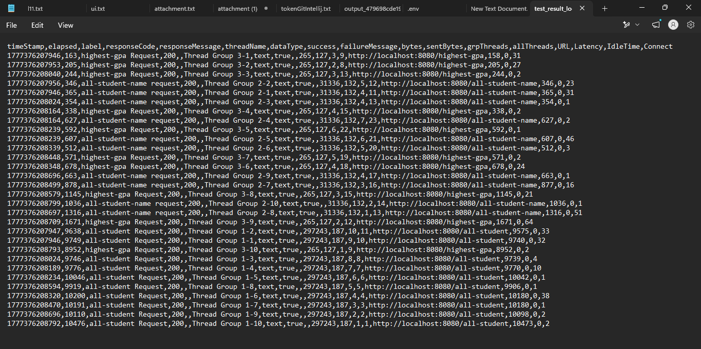
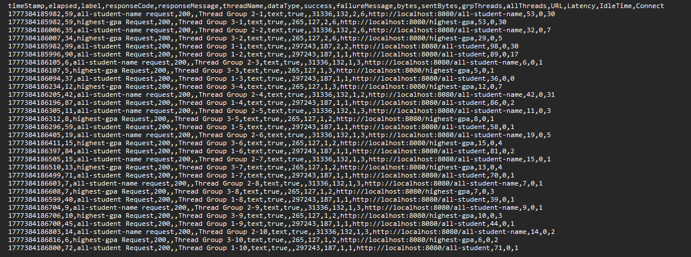

## all-student-name result

## highest-gpa result

# Before and After optimize
## Before

## After

## Conclusion
- Berdasarkan hasil pengukuran pada log, hasil refactor dari ketiga method tersebut memberikan peningkatan yang cukup baik dan >20%. Sebelum optimisasi, endpoint /all-student memerlukan waktu respon yang lama sampai kisaran 10 detik dikarenakan masalah N+1 Query, dan endpoint /highest-gpa menunjukkan latensi yang cukup tinggi sampai 8,9 detik karena maenarik semua data ke memori. Setelah dilakukan optimisasi, waktu respon yang kita dapatkan jauh lebih cepat dibandingkan sebelum dioptimisasi sehingga mengindikasikan peningkatan kecepatan respon.
- Peningkatan ini bisa terjadi karena aplikasi kita tidak lagi melakukan query yang berulang ke databse. Selain itu, beban pemrosesan data dialihkan ke database yang lebih cepat dalam memilih dan menyaring data. Hal tersebut berefek pada waktu tunggu yang jauh lebih stabil dibandingkan sebelumnya. Hasilnya, aplikasi menjadi lebih responsif untuk pengguna, dan lebih scalable karena penggunaan sumber daya menjadi berkurang secara signifikan.

# Reflection
1. What is the difference between the approach of performance testing with JMeter and
   profiling with IntelliJ Profiler in the context of optimizing application performance?
    - Perbedaannya terletak pada cakupan dan metrik yang diukur. Pada JMeter, pengujian yang dilakukan dari sisi eksternal, seperti mensimulasikan beban asli untuk mengukur response Time, Throughput, dan kestabilan sistem ketika mendapat beban yang berat. Di lain sisi, Intellij Profiler, melakukan pengukuran dari apa yang terjadi di dalam mesin (JVM). Profilernya mengukur penggunaan CPU tiap method, alokasi memori di heap, dan bagaimana aktivitas thread secara spesifik.
2. How does the profiling process help you in identifying and understanding the weak points
   in your application?
    - Profiling memvisualisasikan eksekusi kode sehingga kita tidak perlu menebak-nebak method apa yang membuat suatu aplikasi berjalan lambat. Lewat data real-time, profiling akan menunjukkan method mana yang paling banyak makan siklus CPU, objek apa aja yang tidak dibersihkan Garbage Collector sehingga menumpuk.
3. Do you think IntelliJ Profiler is effective in assisting you to analyze and identify
   bottlenecks in your application code?
    - Sangat efektif karena terhubung langsung dengan IDE sehingga untuk pindah dari visualisasi performa yang buruk bisa langsung ke baris kode untuk diperbaiki. Contohnya pada masalah ini Flame Graph sangat membantu untuk melihat fitur mana yang paling berat.
4. What are the main challenges you face when conducting performance testing and
   profiling, and how do you overcome these challenges?
    - Tantangan utama bagi saya adalah saat melihat hasil profiling, kode library lebih banyak muncul dibanding method yang ktia cari. Cara saya mengatasinya adalah dengan fitur search untuk langsung ke method yang ingin saya perbaiki.
5. What are the main benefits you gain from using IntelliJ Profiler for profiling your
   application code?
    - Menurut saya, manfaat yang saya dapatkan adalah mengetahui bagaimana method mengonsumsi sumber daya dengan tepat. 
6. How do you handle situations where the results from profiling with IntelliJ Profiler are not
   entirely consistent with findings from performance testing using JMeter?
   - Hal yang saya lakukan pertama kali ialah mencari  penyebabnya terlebih dahulu, hal ini bisa saja terjadi karena keduanya dilakukan di lingkungan yang berbeda sehingga masalahnya ada di faktor eksternal seperti latensi jaringan, ataupun perbedaan hardware yang cukup signifikan. Oleh karena itu, untuk mengatasinya kita bisa jalankan ulang profiling dan testing Jmeter di lingkungan yang sama, misalnya lokal kita. Hal ini memastikan variabel lingkungan yang konsisten sehingga hasilnya akan mirip.
7. What strategies do you implement in optimizing application code after analyzing results
   from performance testing and profiling? How do you ensure the changes you make do
   not affect the application's functionality?
    - Strategi-streategi yang saya lakukan adalah memindahkan filter dan sorting yang cukup membebani ke database, dan mengganti algoritma yang lebih efisien. Supaya aplikasi saya tetap berjalan dengan sama, saya lakukan step-step yang sebelumnya sudah saya lakukan dan memastikan hasilnya sama. Namun, metode yang lebih efektif adalah dengan membuat unit-test yang memastikan kerja kode selalu sama sehingga tidak merusak yang sebelumnya kita perbaiki.